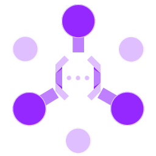
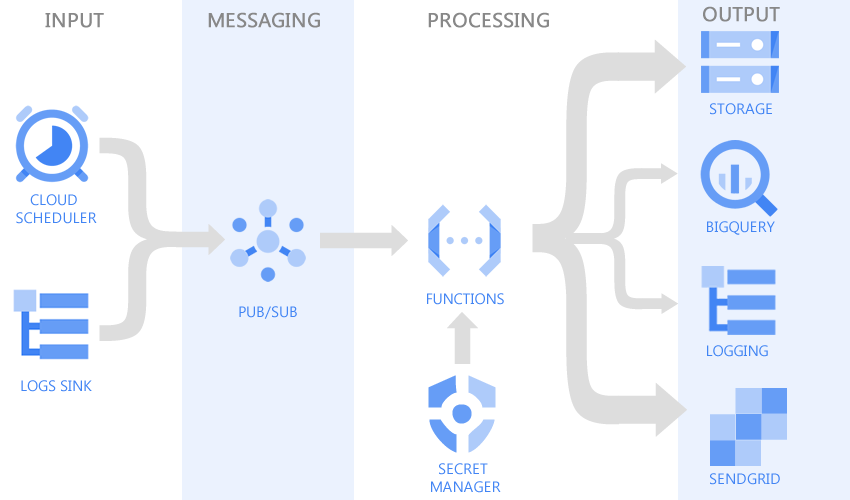
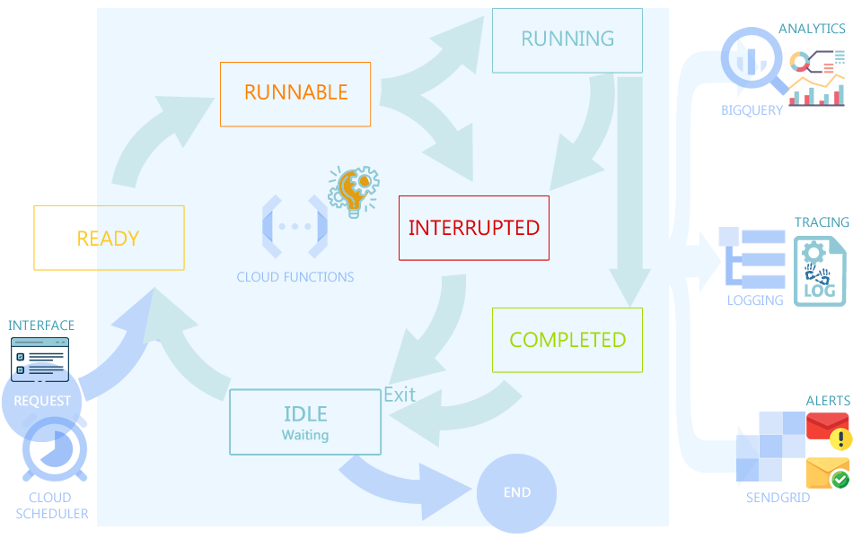

# Pulsar

## Introduction

### Warning: This is an MVP under ideation

Various ETL/ELT frameworks exist to perform data processing by leveraging Compute Engine or Kubernetes Engine, but sometimes these services can be over-kill solutions in terms of resources they may consume if we use them for only a few minutes jobs a day. In these cases, event-based processing is an amazing game-changer in the way we use cloud services since they allow us to build light and tailored services.

### The skeleton architecture
Pulsar aimed to provide a reusable framework skeleton for scalable Cloud Function Apps. This can be done by leveraging Cloud Function 2nd Gen to create an events-based App (for less than 1hour processing jobs) strengthen with services like:

- Cloud Scheduler: for a manual or for the time-based run
- Cloud Logs Sinks: for executions based on event triggers from other cloud services.
- Cloud PubSub: as the messaging layer
- Cloud function 2nd Gen: for on-demand processing resource
- Cloud Storage: for persistent storage to keep files (input and output)
- BigQuery: to add observable and an analytical layer on top of the app
- SendGrid: for the alerting emails to share jobs states
- Secret Manager: for keeping sensitive data instead of hardcoded them in or function (SendGrid key for example)

- The input instructions will come from auto-managed services like Cloud Scheduler and Logs Sinks for programmed or triggered events.
- Pub/Sub will serve as messaging service allowing our cloud function to be highly reliable and scalable
- The processing part of our framework will be managed by Cloud Function coupled with Secret Manager which keeps our versioned secrets. Secret Manager will be used for example to host securely our SendGrid APIs key.
- The output services like Cloud Storage will allow hosting input/output files, BigQuery will enable us to add analytics layers on top of the system, Cloud Logging will be leveraged for logs, and Sendgrid will serve as an email service for direct notifications. 

## Task management and Cloud User Experience

The framework states are related to internal operations of the Cloud Function since it is the processing resource of our components that will host our running logic. Identifying those states and including them in our skeleton design allows us to add some level of observability to our app.

A task is the representation of our processing parameters which will be in JSON. Since JSON is easily consumed by most GCP services, it is a good format for communication between services.
We can then define 4 states for the tasks processed by the Cloud Function, each state can add detailed information generated by the processing to the task information:

- Tasked: when task reception is acknowledged by the cloud function before starting processing;
- Initiate: when our processing logic identifies tasks as executable;
- Processed: when the tasks have been successfully executed;
- Terminated: when tasks cannot be executed correctly for some reason.

### The full tutorial articles are available on this links for more comprehension

- [Part 1: A reusable native Google Cloud App skeleton for events-based Functions](https://medium.com/@ktiyab_42514/pulsar-a-tutorial-of-a-reusable-native-google-cloud-app-skeleton-for-events-based-functions-part-83a1dd71a1be)
- [Part 2: Designing an abstract and consistent infrastructure as a code](https://medium.com/@ktiyab_42514/pulsar-designing-an-abstract-and-consistent-infrastructure-as-a-code-part-2-10654bc630ed)
- [Part 3: Ideation of a Cloud User Experience and interaction design conception](https://medium.com/@ktiyab_42514/pulsar-ideation-of-a-cloud-user-experience-and-interaction-design-conception-part-3-2d7533e917e3)
- [Part 4: Easily Boost your GCP Cloud functions with the Pulsar framework]

## Deployment

### Activate APIs below
https://console.cloud.google.com/apis/dashboard 
- Cloud Storage
- Cloud Secret Manager
- Cloud Logging
- Cloud Pub/sub
- Cloud function
- Cloud run
- Cloud scheduler
- Cloud Build
- Eventarc API
- Artifact Registry API

### Service account creation

Create a service account with this permissions (don't download the json key)
https://console.cloud.google.com/iam-admin/serviceaccounts

- BigQuery Data Editor
- BigQuery Job User
- Service Account User
- Logging Admin
- Pub/Sub Editor
- Storage Admin
- Secret Manager Secret Accessor
- Cloud Run Invoker

### Sendgrid API
Configure sendgrid with your API Key
  - Modify the "mail_from" and "default_mail_to" variable in the folder secrets\pulsar_sendgrid.template_json file with your Sendgrid verified email
  - Modify the "pulsar_sendgrid_key" variable in the file with your Sendgrid API key
  - Rename your file pulsar_sendgrid.json

### Add your custom functionalities with custom classes

[Coming soon]

### Leverage the built-in events management system

[Coming soon]

### Jobs definitions with pulsar

[Coming soon]

### Deploy your app

[Coming soon]