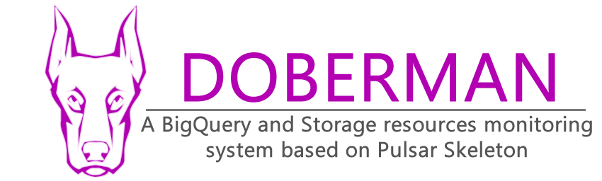

## Pulsar: Custom "watchdog" to detect non-compliances for BigQuery & Storage items creation (Part 6)

> This is a code repository the part 6 of the Pulsar tutorials. Pulsar aims to provide a reusable framework skeleton for
> scalable Cloud Function Apps. It allows you to quickly create Google Cloud Functions with notification and monitoring 
> abilities in a few steps. This article is a continuation of the tutorials about the ideation of Pulsar, you can read 
> the first article [here](https://medium.com/@ktiyab_42514/pulsar-a-tutorial-of-a-reusable-native-google-cloud-app-skeleton-for-events-based-functions-part-83a1dd71a1be).

This 6th part of the series of articles is dedicated to the event management system integrated into the Pulsar skeleton.
For the purposes of this tutorial, we are going to solve a simple use case in which Pulsar will help us solve a problem.
This tutorial is a bit longer because it explains some basic concepts of event management in Google Cloud Platform, 
so don't hesitate to take a break between reading and applying.

The full tutorial of this Cloud App creation is available [here]()

> Some built-in or third-party Google Cloud Platform solutions exist that can do the same thing, but this tutorial's 
> purpose is for understanding how these systems can work behind the scenes, or creating a simple and custom one.