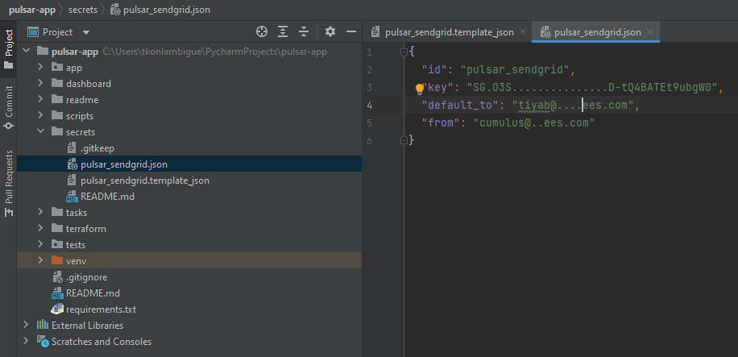
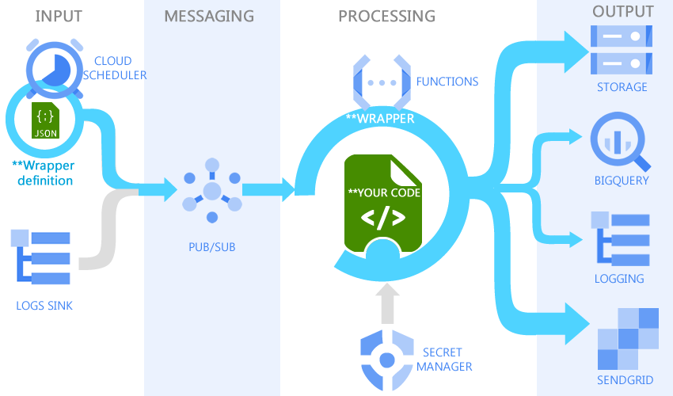
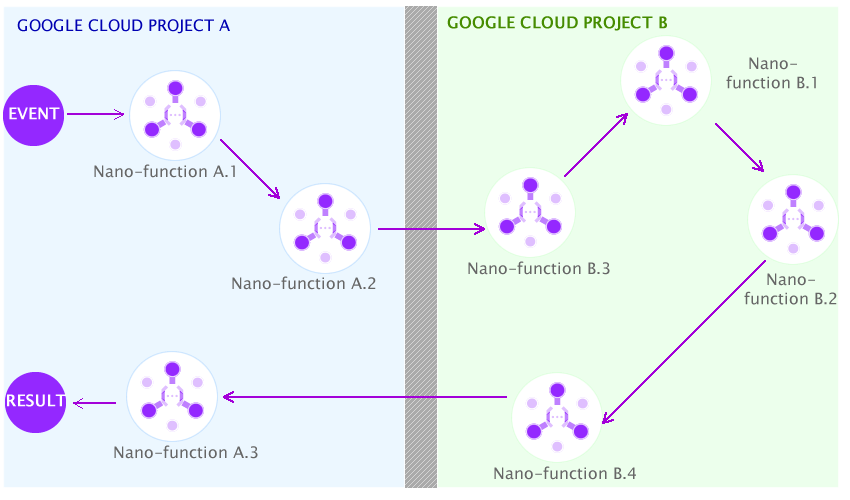

# Pulsar

## I - Introduction

### Warning: This is an MVP under ideation

> Pulsar aims to provide a reusable framework skeleton for scalable Cloud Function Apps. It allows you to quickly create GCP Cloud Functions with event-based, alerting and monitoring abilities in a few steps.

The Google Cloud Functions are wonderful on demand-service allowing us to create micro/nano services. But it can be hard and time-consumed to create a stable and scalable application with it since the service doesn't include some functionalities essential to building "full" apps like:

- A built-in notification by email functionality that allows being alerted about tasks status (failures and successes);
- A built-in analytics capability with a monitoring dashboard;
- A built-in events manager system that allows to easily create event-based functions;
- A built-in secret manager system;
- A built-in tasks cycle monitoring system.

### 1.1 - The skeleton architecture
Pulsar provide a reusable framework skeleton for scalable Cloud Function Apps. This can be done by leveraging Cloud Function 2nd Gen to create an events-based App (for less than 1hour processing jobs) strengthen with services like:

- Cloud Scheduler: for a manual the time-based run;
- Cloud Logs Sinks: for executions based on event triggers from other cloud services;
- Cloud PubSub: as the messaging layer;
- Cloud function 2nd Gen: for on-demand processing resource;
- Cloud Storage: for persistent storage to keep files (input and output);
- BigQuery: to add observable and an analytical layer on top of the app;
- SendGrid: for the alerting emails to notify jobs states;
- Secret Manager: for keeping sensitive data instead of hardcoded them in your function (SendGrid key for example);


How does this architecture work? 

- The input instructions will come from auto-managed services like Cloud Scheduler and Logs Sinks for programmed or triggered events;
- Pub/Sub will serve as messaging service allowing our cloud function to be highly reliable and scalable;
- The processing part of our framework will be managed by Cloud Function coupled with Secret Manager which keeps our versioned secrets. Secret Manager will be used for example to host securely our SendGrid APIs key;
- The output services like Cloud Storage will allow hosting input/output files, BigQuery will enable us to add analytics layers on top of the system, Cloud Logging will be leveraged for logs, and Sendgrid will serve as an email service for direct notifications. 

### 1.2 - Task management and Cloud User Experience

The framework states are related to internal operations of the Cloud Function since it is the processing resource of our components that will host our running logic. Identifying those states and including them in our skeleton design allows us to add some level of observability to our app.


A task is the representation of our processing parameters which will be in JSON. Since JSON is easily consumed by most GCP services, it is a good format for communication between services.
We can then define 4 states for the tasks processed by the Cloud Function, each state can add detailed information generated by the processing to the task information:

- Ready: when task reception is acknowledged by the cloud function before starting processing;
- Runnable: when the processing logic identifies tasks as executable;
- Completed: when the tasks have been successfully executed;
- Interrupted: when tasks cannot be executed correctly for some reason.

### 1.3 - The full tutorial articles are available on these links for more comprehension

- [Part 1: A reusable native Google Cloud App skeleton for events-based Functions](https://medium.com/@ktiyab_42514/pulsar-a-tutorial-of-a-reusable-native-google-cloud-app-skeleton-for-events-based-functions-part-83a1dd71a1be)
- [Part 2: Designing an abstract and consistent infrastructure as a code](https://medium.com/@ktiyab_42514/pulsar-designing-an-abstract-and-consistent-infrastructure-as-a-code-part-2-10654bc630ed)
- [Part 3: Ideation of a Cloud User Experience and interaction design conception](https://medium.com/@ktiyab_42514/pulsar-ideation-of-a-cloud-user-experience-and-interaction-design-conception-part-3-2d7533e917e3)
- [Part 4: Boost your python Google Cloud Functions with a pulsar skeleton](https://medium.com/@ktiyab_42514/pulsar-easily-deploy-a-boosted-python-gcp-functions-with-a-dedicated-skeleton-part-4-6c1ce42a222a)

## II - Deployment

The step-by-step deployment article is available at this link: 
[Part 4: Boost your python Google Cloud Functions with a pulsar skeleton](https://medium.com/@ktiyab_42514/pulsar-easily-deploy-a-boosted-python-gcp-functions-with-a-dedicated-skeleton-part-4-6c1ce42a222a)

### 2.1 - Activate services & APIs leveraged by the skeleton

Pulsar is a cloud-native app that aggregates existing GCP services to integrate useful functionalities natively into your cloud functions. You have to enable some GCP APIs and Services for the deployment purpose in the API & Services section of your GCP account:
https://console.cloud.google.com/apis/dashboard

- Cloud Storage for persistent storage (enabled by default) : https://console.cloud.google.com/apis/library/storage-component.googleapis.com
- Cloud Secret Manager, for keeping securely sensitive secrets instead of hardcoded them in your code: https://console.cloud.google.com/apis/library/secretmanager.googleapis.com
- Cloud Logging for the app logs and debugging (enabled by default): https://console.cloud.google.com/apis/library/logging.googleapis.com
- Cloud PubSub for messaging and scalability capabilities: https://console.cloud.google.com/apis/library/pubsub.googleapis.com
- Cloud function for on-demand processing resource: https://console.cloud.google.com/apis/library/cloudfunctions.googleapis.com
- Cloud run for the cloud function deployment: https://console.cloud.google.com/apis/library/run.googleapis.com
- Cloud Scheduler which will serve as a user interface for manual or for time-based triggering: https://console.cloud.google.com/apis/library/cloudscheduler.googleapis.com
- Cloud Build for the cloud function build: https://console.cloud.google.com/apis/library/cloudbuild.googleapis.com
- Eventarc API for asynchronous events delivery: https://console.cloud.google.com/apis/library/eventarc.googleapis.com
- Artifact Registry API for functions container image: https://console.cloud.google.com/apis/library/artifactregistry.googleapis.com


### 2.2 - Service account creation

You have to create a dedicated service account with these permissions on services for the app. You don't have to download the JSON key since the app will work in isolation inside GCP.
https://console.cloud.google.com/iam-admin/serviceaccounts

- BigQuery Data Editor
- BigQuery Job User
- Service Account User
- Logging Admin
- Pub/Sub Editor
- Storage Admin
- Secret Manager Secret Accessor
- Cloud Run Invoker


You don’t have to do anything in step 3, click “done” to create the service account and ***retain/copy the email of the service account***.

### 2.3 - Sendgrid API
In a few words, SendGrid is a cloud-based SMTP provider that allows you to send emails without having to maintain email servers.

To configure SendGrid you need a corporate email address (pseudo@custom_domain.com) allowing the service to trust your identity. 
You can activate the SendGrid service for your GCP account at this link: https://console.cloud.google.com/marketplace/details/sendgrid-app/sendgrid-email


[Follow instruction to Activate SendGrid add-on on GCP and obtain you API key](https://console.cloud.google.com/marketplace/details/sendgrid-app/sendgrid-email)

After obtaining your API key you must create the SendGrid configuration of your app inside the **“secrets”** folder by using the template **“pulsar_sendgrid.template.json”**.


  - Modify the "default_to" and "from" variable in the folder **"/secrets/pulsar_sendgrid.template_json"** file with your Sendgrid verified email.
      - The **"id"** represents the reference of the key;
      - The **"key"** represents your Sendgrid key;
      - The **"default_to"** represents the default email that must receive alerts in case of system failure;
      - The **"from"** must be the email you use to register in Sendgrid.
    
  - Modify the "key" variable in the file with your Sendgrid API key
  - Rename your file pulsar_sendgrid.json

```json
{
  "id": "pulsar_sendgrid",
  "key": "<SENDGRID_KEY>",
  "default_to": "<DEFAULT_ALERT_EMAIL_DESTINATION>",
  "from": "<EMAIL_REGISTERED_IN_SENDGRID>"
}
```



> By default, all **.json** files in the secret folder are ignored by git for security reasons.

## III - Add your custom functionalities with custom classes

### 3.1 Understand the Pulsar wrapper

In computer science, a wrapper is any entity that encapsulates (wraps around) another item. Wrappers are used for two primary purposes: to convert data to a compatible format or to hide the complexity of the underlying entity using abstraction. In our case, Pulsar provides cloud-native but complicated and time-consuming features to implement on top of your code.
Behind the scene, to provide monitoring-ready and event-driven functionality to your app, Pulsar works as a wrapper of your custom code.



The execution of your code by Pulsar is a task  with several predefined states to make it observable:

- Ready: when task reception is acknowledged by the cloud function before starting processing;
- Runnable: when the processing logic identifies tasks as executable;
- Completed: when the tasks have been successfully executed;
- Interrupted: when tasks cannot be executed correctly for some reason.


### 3.1 How to add and run your custom code

You have to add your custom classes in the package folder **"/app/custom/"**, and can execute it from the scheduler call by indicating the path to your class with parameters.

For example, if you have a module **sample.py"**, with the class **"Greeting"** inside and you want to call the function **"get(name):"** below how you can do it: 

```python
class Greeting(object):
    def __init__(self):
        pass

    @staticmethod
    def get(name):
        return "Get Hello {}".format(name)
```

You have to call it from a Cloud Scheduler linked to the Pulsar topic in this manner:
```json
{
	"name": "Greeting",
	"description": "Get Hello <parameter>.",
	"alert_level": "1",
	"owners": "tiyab@gcpbees.com",
	"parameters": {
		"run": "custom.sample.Greeting.get:Serhat"
	}
}
```
All JSON keys are mandatory:

- The **"name"** is that of your job, which is used to identify it among other jobs in notifications and data analysis;
- The **"description"** of your job
- For **"alert_level"** you can define 3 levels:
  - Level 0, send alerts only on failure (interrupted tasks)
  - Level 1, send alerts on failure or job completion (completed or interrupted tasks)
  - Level 2, send alerts on every state of the job task (ready, runnable and completed tasks)
- With the **"owners"** key, you can indicate people you want to notify by email, separate emails with pipe (gjuliette@gcpbees.com|droman@gcpbees.com)
- The **"parameters"** allows you to indicate which function to run, you can do it by providing the path to the **"run"** sub-key in this way: package.module.class.function:Param1,Param2


### 3.2 - Nano-functions and nano-services with Pulsar

#### 3.2.1 - What's nano services/functions
Pulsar aims to provide a scalability-ready skeleton for your nano-services. Even if the architecture design is mainly focused (recommended) on nano-services usage it can be leveraged to create micro-service too.

What's a nano-service? A nano-service is designed to do one thing only, they  are designed to be discoverable, by and for each other. This means that if you need your nano-services to do more than one thing, you can extend them by linking them to other, existing nano-services.



The nano-services have benefits beyond their technical advantages over microservices. By being smaller than microservices, nano-services make it possible for different data teams (engineers, architects, scientists, or analysts) to be dedicated to one or more services at any given time. Each nano service can be built according to its own roadmap and released according to its own independent release schedule.

Because the function specializes in providing a specific service, the amount of code is less dense and therefore maintainable. Similarly, it is easy to know the scope and limit the impact of a nano-service in case of a problem or decommissioning.

#### 3.1.2 - How to pass the processing results of your functions to another

Pulsar built-in functionality allows you to pass your function execution results to another system by indicating a targeted Pub/Sub or directly another Pulsar function to run. In doing so, you can aggregate separate specialized functions in different ways to achieve different results.

For example below is a custom class with two functionalities:

```python
class Greeting(object):
    def __init__(self):
        pass

    @staticmethod
    def get(name):
        return " Get Hello {}".format(name)

    @staticmethod
    def say(message):
        return " Say {}".format(message)
```

This task definition below from Cloud Scheduler allows to run the first function and pass the result to the second one:

```json
{
  "name": "Say Get Greeting",
  "description": "return: Say Get Hello <parameter>",
  "alert_level": "1",
  "owners": "tiyab@gcpbees.com",
  "parameters": {
    "run": "custom.sample.Greeting.get:Pulsar",
    "response_to": "gcpbees-test.pulsar-topic@custom.sample.Greeting.say:{}"
  }
}
```
The **"response_to"** key allows the activation of the function response forwarding functionality:

- By indicating the project id and the topic in this way: **"project_id.topic_id:{}"**, the response will by sent to a topic ({} will be replaced with your data)
- If the topic is a pulsar one, you can indicate the dedicated function you want to target by adding the path in this way: **"@package.module.class.function:{}"**.

You must favor responses as JSON encoded in terms of data returned by your nano-functions for consumption by other ones, below are some examples

From your source response:

```python
import base64
...
def response(json_data):
    # Encode the resource information before forwarding
    data_bytes = json_data.encode("utf-8")
    encoded_data = base64.b64encode(data_bytes)
    decoded_data = encoded_data.decode("utf-8")
    return decoded_data
```

In the destination function for consumption

```python
import base64
...
def consume(payload):
    # Decode forwarded resource information before consumption
    base64_str = payload.encode("utf-8")
    base64_bytes = base64.b64decode(base64_str)
    decode_str = base64_bytes.decode("utf-8")   
    ...
```

### 3.2 - Leverage the built-in events management system

The built-in event management system allows you to easily leverage Google Cloud Logging Sink to create an event-based function with the Pulsar framework. 
For more about Logging Sink: https://cloud.google.com/logging/docs/export/configure_export_v2

- You have first to create a Sink with a destination into the Pulsar Pub/Sub topic: https://console.cloud.google.com/logs/router


- After that, you have to create a dedicated class if not exist in the module **"app/libs/gcp/logging/sink.py"** allowing you to automatically extract the data you want from the sink payload. 
Below is an example of a part of a sink data during storage object creation:

```json
{
    "protoPayload": {
        "methodName": "storage.objects.create",
        "authenticationInfo": {
            "principalEmail": "tiyab@gcpbees.com"
        },
        "requestMetadata": {
            "callerIp": "127.0.0.1"
        }
    },
    "resource": {
        "type": "gcs_bucket",
        "labels": {
            "location": "europe-west1",
            "project_id": "gcp_bees",
            "bucket_name": "crm_data"
        }
    },
    "resourceName": "projects/_/buckets/logs_sink_gcs",
    "timestamp": "2022-06-01T23:04:53.682013137Z"
}
```
  - Your class name must be the GCP resource type name, for example  for the type **"gcs_bucket"** from the ["resource"]["type"] value, class name must be **"GcsBucket"**
  - You have to define a function dedicated to the data extraction for your task which must be the ["protoPayload"]["methodName"] value, for example the function name of the methodName **"storage.objects.create"** must be **"def storage_objects_create(payload):"**
  - The function consumes a "payload" (JSON data) from the sink and returns extracted data you want from the payload for your purpose

```python
import calendar
import json
import time
class GcsBucket(object):
    """
    Resource type name is "gcs_bucket" > class GcsBucket
    You can extend extracted values
    """

    @staticmethod
    def storage_objects_create(payload):

        """
        GCP methodName: storage.objects.create > function name: storage_objects_create
        Load key values as json
        :param payload:
        :return: JSON str
        """
        return json.dumps({
            "resourceType": payload["resource"]["type"],
            "methodName": payload["protoPayload"]["methodName"],
            "principalEmail": payload["protoPayload"]["authenticationInfo"]["principalEmail"],
            "callerIP": payload["protoPayload"]["requestMetadata"]["callerIp"],
            "resourceLocation": payload["resource"]["labels"]["location"],
            "resourceProjectId": payload["resource"]["labels"]["project_id"],
            "resourceBucketName": payload["resource"]["labels"]["bucket_name"],
            "resourceName": payload["resource"]["labels"]["bucket_name"],
            "timestamp": str(calendar.timegm(time.gmtime()))
        })
```

  - Finally to consume the sink data in your custom process, you must create a custom class in the package **"app/custom/"**, 
for example for the resource type **"gcs_bucket"**  the module must be **"gcs_bucket.py"**, the class name must be **"GcsBucket"**  
and the consumption function name must be the methodName **"def storage_objects_create(payload):"** (storage.objects.create)

```python
import base64

class GcsBucket(object):

    @staticmethod
    def storage_objects_create(payload):

        base64_str = payload.encode("utf-8")
        base64_bytes = base64.b64decode(base64_str)
        decode_str = base64_bytes.decode("utf-8")

        return str(decode_str)
```

This reflection system allows you to quickly create and extend event-based functionalities in your functions.


## IV - Deploy your app

### 4.1 - Deployment with native GCP CLI (stable)

The shell scripts for Pulsar deployment in the "scripts" folder allow to deploy the your app by using Google Cloud CLI. 

- 1 - Install Google Cloud CLI from this link: https://cloud.google.com/sdk/docs/install 
- 2 - Create a deployment service/user account with permissions for GCP services listed above.
- 3 - Open the folder "/scripts/" from you command line
- 4 - The deployment command below will guide you through the questions/responses process (Y/N) in order to configure or not services. For the first deployment, you have to create items/configure all services, but for update the script allows you to skip some parts of the deployment. 
You must always accept GCS files redeployment in order to do cloud function redeployment
```shell
$./deploy.sh "APP-NAME"  "PROJECT-ID"  "REGION"  "EXISTING-SERVICE-ACCOUNT-EMAIL"
```
- 5 - Removal command: you can remove specific app by running command below
```shell
$./remove.sh "APP-NAME"  "PROJECT-ID"  "REGION"
```

### 4.2 - Deployment with terraform (ongoing - not stable yet)

The "terraform" folder contains the terraform script for deployment.
More about terraform: https://learn.hashicorp.com/tutorials/terraform/install-cli?in=terraform/gcp-get-started

- 1.a - (Only for local tests) Execute the command below to create default credential
```shell
$ gcloud auth application-default login --no-browser
```
- 1.b - Instead of using default credential, it's recommended to create a dedicated service account to terraform
- 2 Deploy
```shell
$ terraform init 
$ terraform plan -var="PULSAR_NAME=[APP-NAME]" -var="PROJECT_ID=[PROJECT-ID]" -var="PULSAR_REGION=[REGION]" -var="SERVICE_ACCOUNT_EMAIL=[SERVICE-ACCOUNT-EMAIL]" -out=tf.plan
$ terraform apply "tf.plan"
```