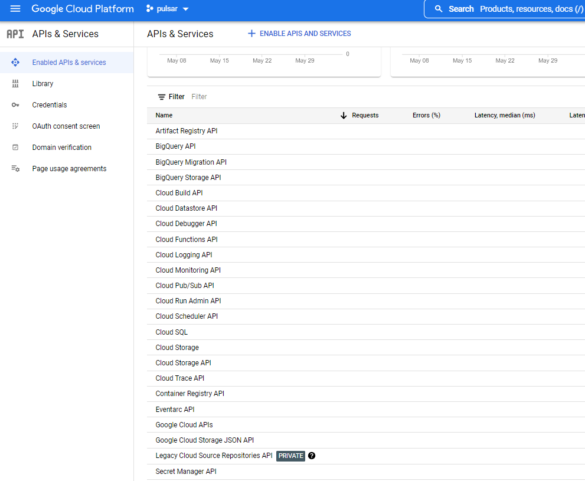
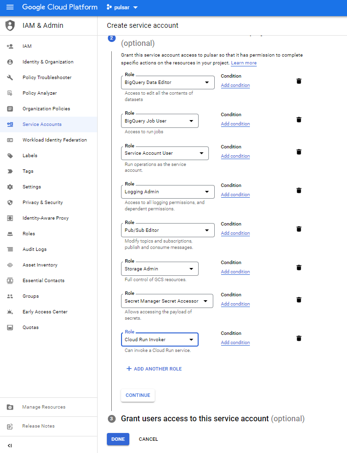
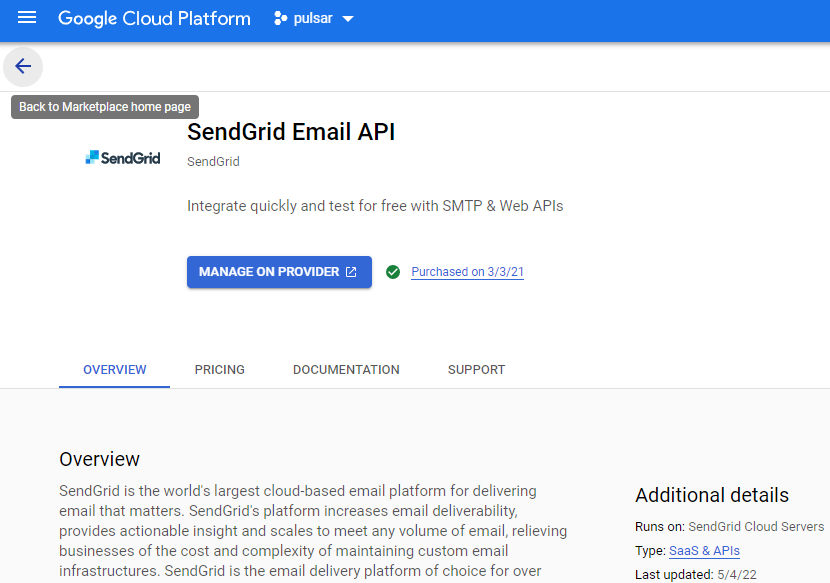

# Pulsar

## I - Introduction

### Warning: This is an MVP under ideation

> Pulsar aims to provide a reusable framework skeleton for scalable Cloud Function Apps. It allows you to quickly create GCP Cloud Functions with event-based, alerting and monitoring abilities in a few steps.

The Google Cloud Functions are wonderful on demand-service allowing us to create micro/nano services. But it can be hard and time-consumed to create a stable and scalable application with it since the service doesn't include some functionalities essential to building "full" apps like:

- A built-in notification by email functionality that allows being alerted about tasks status (failures and successes);
- A built-in analytics capability with a monitoring dashboard;
- A built-in events manager " system that allows to easily create event-based functions;
- A built-in secret manager system;
- A built-in tasks cycle monitoring system.

### 1.1 - The skeleton architecture
Pulsar aim to provide a reusable framework skeleton for scalable Cloud Function Apps. This can be done by leveraging Cloud Function 2nd Gen to create an events-based App (for less than 1hour processing jobs) strengthen with services like:

- Cloud Scheduler: for a manual or for the time-based run
- Cloud Logs Sinks: for executions based on event triggers from other cloud services.
- Cloud PubSub: as the messaging layer
- Cloud function 2nd Gen: for on-demand processing resource
- Cloud Storage: for persistent storage to keep files (input and output)
- BigQuery: to add observable and an analytical layer on top of the app
- SendGrid: for the alerting emails to share jobs states
- Secret Manager: for keeping sensitive data instead of hardcoded them in your function (SendGrid key for example)


- The input instructions will come from auto-managed services like Cloud Scheduler and Logs Sinks for programmed or triggered events.
- Pub/Sub will serve as messaging service allowing our cloud function to be highly reliable and scalable
- The processing part of our framework will be managed by Cloud Function coupled with Secret Manager which keeps our versioned secrets. Secret Manager will be used for example to host securely our SendGrid APIs key.
- The output services like Cloud Storage will allow hosting input/output files, BigQuery will enable us to add analytics layers on top of the system, Cloud Logging will be leveraged for logs, and Sendgrid will serve as an email service for direct notifications. 

### 1.2 - Task management and Cloud User Experience

The framework states are related to internal operations of the Cloud Function since it is the processing resource of our components that will host our running logic. Identifying those states and including them in our skeleton design allows us to add some level of observability to our app.


A task is the representation of our processing parameters which will be in JSON. Since JSON is easily consumed by most GCP services, it is a good format for communication between services.
We can then define 4 states for the tasks processed by the Cloud Function, each state can add detailed information generated by the processing to the task information:

- Ready: when task reception is acknowledged by the cloud function before starting processing;
- Runnable: when our processing logic identifies tasks as executable;
- Completed: when the tasks have been successfully executed;
- Interrupted: when tasks cannot be executed correctly for some reason.

### 1.3 - The full tutorial articles are available on these links for more comprehension

- [Part 1: A reusable native Google Cloud App skeleton for events-based Functions](https://medium.com/@ktiyab_42514/pulsar-a-tutorial-of-a-reusable-native-google-cloud-app-skeleton-for-events-based-functions-part-83a1dd71a1be)
- [Part 2: Designing an abstract and consistent infrastructure as a code](https://medium.com/@ktiyab_42514/pulsar-designing-an-abstract-and-consistent-infrastructure-as-a-code-part-2-10654bc630ed)
- [Part 3: Ideation of a Cloud User Experience and interaction design conception](https://medium.com/@ktiyab_42514/pulsar-ideation-of-a-cloud-user-experience-and-interaction-design-conception-part-3-2d7533e917e3)
- [Part 4: Easily Boost your GCP Cloud functions with the Pulsar framework]

## II - Deployment

The step by step article link: [Part 4: Easily Boost your GCP Cloud functions with the Pulsar framework]

### 2.1 - Activate services & APIs leveraged by the skeleton

Pulsar is a cloud-native app that aggregates existing GCP services to integrate useful functionalities natively into your cloud function. You have to enable some GCP APIs and Services for the deployment purpose in the API & Services section of your GCP account:
https://console.cloud.google.com/apis/dashboard

- Cloud Storage for persistent storage (enabled by default) : https://console.cloud.google.com/apis/library/storage-component.googleapis.com
- Cloud Secret Manager, for keeping securely sensitive secrets instead of hardcoded them in your code: https://console.cloud.google.com/apis/library/secretmanager.googleapis.com
- Cloud Logging for the app logs and debugging (enabled by default): https://console.cloud.google.com/apis/library/logging.googleapis.com
- Cloud PubSub for messaging and scalability capabilities: https://console.cloud.google.com/apis/library/pubsub.googleapis.com
- Cloud function for on-demand processing resource: https://console.cloud.google.com/apis/library/cloudfunctions.googleapis.com
- Cloud run for the cloud function deployment: https://console.cloud.google.com/apis/library/run.googleapis.com
- Cloud Scheduler which will serve as a user interface for manual or for time-based triggering: https://console.cloud.google.com/apis/library/cloudscheduler.googleapis.com
- Cloud Build for the cloud function build: https://console.cloud.google.com/apis/library/cloudbuild.googleapis.com
- Eventarc API for asynchronous events delivery: https://console.cloud.google.com/apis/library/eventarc.googleapis.com
- Artifact Registry API for functions container image: https://console.cloud.google.com/apis/library/artifactregistry.googleapis.com



### 2.2 - Service account creation

You have to create a dedicated service account with these permissions on services for the app. You don't have to download the JSON key since the app will work in isolation inside GCP.
https://console.cloud.google.com/iam-admin/serviceaccounts

- BigQuery Data Editor
- BigQuery Job User
- Service Account User
- Logging Admin
- Pub/Sub Editor
- Storage Admin
- Secret Manager Secret Accessor
- Cloud Run Invoker



### 2.3 - Sendgrid API

To configure SendGrid you need a corporate email address (pseudo@custom_domain.com) allowing the service to trust your identity. 
You can activate the SendGrid service for your GCP account at this link: https://console.cloud.google.com/marketplace/details/sendgrid-app/sendgrid-email

  - [Follow instruction to Activate SendGrid add-on on GCP and obtain you API key](https://console.cloud.google.com/marketplace/details/sendgrid-app/sendgrid-email)
  - Modify the "mail_from" and "default_mail_to" variable in the folder **"/secrets/pulsar_sendgrid.template_json"** file with your Sendgrid verified email
  - Modify the "pulsar_sendgrid_key" variable in the file with your Sendgrid API key
  - Rename your file pulsar_sendgrid.json

More about creating a SendGrid API key: https://docs.sendgrid.com/ui/account-and-settings/api-keys#creating-an-api-key



## III - Add your custom functionalities with custom classes

You can add you custom classes in the package folder **"/app/custom/"**, and can execute it from the scheduler call by indicating the path to your class with parameters.

For example, if you have a module name "sample.py", with the class "Greeting" inside and you want to call the function "get(name):", 

```python
class Greeting(object):
    def __init__(self):
        pass

    @staticmethod
    def get(name):
        return "Hello {}".format(name)
```

You have to call it from a Cloud Scheduler liked to the Pulsar topic in this manner:
```json
{
	"name": "Greeting",
	"description": "Say greeting.",
	"alert_level": "1",
	"owners": "tiyab@gcpbees.com",
	"parameters": {
		"run": "custom.sample.Greeting.say:Serhat"
	}
}
```
All json key are mandatory:

- The name is that of your work, which is used to identify it among other things in notifications and analyzes
- The description of your job
- For alert_level you have 3 ones
  - Level 0, send alerts only on failure
  - Level 1, send alerts on failure or job completion
  - Level 2, send alerts on every state of the job task
- With "owners" key, you can indicate people you want to notify by email, separate email with pipe (gjuliette@pular.com|droman@pulsar.com)
- Parameters allow you to indicate which function to run, you can do it by providing your function to "run" path: package.module.class.function:Param1,Param2

### 3.1 - Pass executed function result to another pubsub

A built-in functionality allows you to pass your function execution results to another system by indicating a targeted Pub/Sub, for example below a class:

```python
class Greeting(object):
    def __init__(self):
        pass

    @staticmethod
    def get(name):
        return "Hello {}".format(name)

    @staticmethod
    def say(name):
        return "Hello {}".format(name)
```

This definition below from Cloud Scheduler allows to run the first function and pass the result to the second one:

```json
{
  "name": "Greeting",
  "description": "return: Hello <parameter>",
  "alert_level": "1",
  "owners": "tiyab@gcpbees.com",
  "parameters": {
    "run": "custom.sample.Greeting.get:Pulsar",
    "response_to": "gcpbees-test.pulsar-topic@custom.sample.Greeting.get: Forwarded {}"
  }
}
```
The response_to key allow to activate this response forwarding functionalities:

- by indicating the PROJECT_ID.TOPIC_ID:{} the response will by send to a topic ({} will be replace with your data)
- if the topic is a pulsar one, you can indicate the function you want to target

You must favor responses in JSON in terms of data returned by your functions.

### 3.2 - Leverage the built-in events management system

The built-in event management system allows you to easily leverage Google Cloud Logging Sink to create an event-based function with the Pulsar framework. 
For more about Logging Sink: https://cloud.google.com/logging/docs/export/configure_export_v2

- You have first to create a Sink with a destination into the Pulsar Pub/Sub topic: https://console.cloud.google.com/logs/router


- After that, you have to create a dedicated class if not exist in the module **"app/libs/gcp/logging/sink.py"** allowing you to automatically extract the data you want from the sink payload. 
Below is an example of a part of a sink data during storage object creation:

```json
{
    "protoPayload": {
        "methodName": "storage.objects.create",
        "authenticationInfo": {
            "principalEmail": "tiyab@gcpbees.com"
        },
        "requestMetadata": {
            "callerIp": "127.0.0.1"
        }
    },
    "resource": {
        "type": "gcs_bucket",
        "labels": {
            "location": "europe-west1",
            "project_id": "gcp_bees",
            "bucket_name": "crm_data"
        }
    },
    "resourceName": "projects/_/buckets/logs_sink_gcs",
    "timestamp": "2022-06-01T23:04:53.682013137Z"
}
```
  - Your class name must be the GCP resource type name, for example  for the type **"gcs_bucket"** from the ["resource"]["type"] value, class name must be **"GcsBucket"**
  - You have to define a function dedicated to the data extraction for your task which must be the ["protoPayload"]["methodName"] value, for example the function name of the methodName **"storage.objects.create"** must be **"def storage_objects_create(payload):"**
  - The function consumes a "payload" (JSON data) from the sink and returns extracted data you want from the payload for your purpose

```python
import calendar
import json
import time
class GcsBucket(object):
    """
    Resource type name is "gcs_bucket" > class GcsBucket
    You can extend extracted values
    """

    @staticmethod
    def storage_objects_create(payload):

        """
        GCP methodName: storage.objects.create > function name: storage_objects_create
        Load key values as json
        :param payload:
        :return: JSON str
        """
        return json.dumps({
            "resourceType": payload["resource"]["type"],
            "methodName": payload["protoPayload"]["methodName"],
            "principalEmail": payload["protoPayload"]["authenticationInfo"]["principalEmail"],
            "callerIP": payload["protoPayload"]["requestMetadata"]["callerIp"],
            "resourceLocation": payload["resource"]["labels"]["location"],
            "resourceProjectId": payload["resource"]["labels"]["project_id"],
            "resourceBucketName": payload["resource"]["labels"]["bucket_name"],
            "resourceName": payload["resource"]["labels"]["bucket_name"],
            "timestamp": str(calendar.timegm(time.gmtime()))
        })
```

  - Finally to consume the sink data in your custom process, you must create a custom class in the package **"app/custom/"**, 
for example for the resource type **"gcs_bucket"**  the module must be **"gcs_bucket.py"**, the class name must be **"GcsBucket"**  
and the consumption function name must be the methodName **"def storage_objects_create(payload):"** (storage.objects.create)

```python
import base64

class GcsBucket(object):

    @staticmethod
    def storage_objects_create(payload):

        base64_str = payload.encode("utf-8")
        base64_bytes = base64.b64decode(base64_str)
        decode_str = base64_bytes.decode("utf-8")

        return str(decode_str)
```

This reflection system allows you to quickly create and extend event-based functionalities in your functions.


## IV - Deploy your app

The shell script for Pulsar deployment in the "scripts" folder allow to deploy the your app by using Google Cloud CLI. 

- 1 - Install Google Cloud CLI from this link: https://cloud.google.com/sdk/docs/install 
- 2 - Create a service account with your application permissions scope in GCP (Step described above)
- 3 - The deployment command below will guide you through the questions/responses process (Y/N) in order to configure or not services. For the first deployment, you have to create items/configure all services, but for update the script allows you to skip some parts of the deployment. 
You must always accept GCS files redeployment in order to do cloud function redeployment
```shell
./deploy.sh "APP-NAME"  "PROJECT-ID"  "REGION"  "EXISTING-SERVICE-ACCOUNT-EMAIL"
```
- 4 - Removal command: 
```shell
./remove.sh "APP-NAME"  "PROJECT-ID"  "REGION"
```