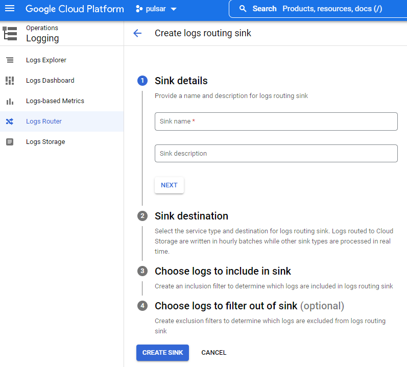
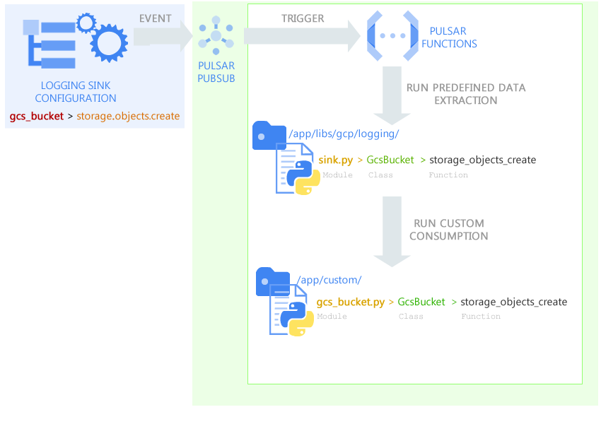

## III - Add your custom functionalities with custom classes

You can add you custom classes in the package folder **"/app/custom/"**, and can execute it from the scheduler call by indicating the path to your class with parameters.

For example, if you have a module name **sample.py"**, with the class **"Greeting"** inside and you want to call the function **"get(name):"** below how you can do it: 

```python
class Greeting(object):
    def __init__(self):
        pass

    @staticmethod
    def get(name):
        return "Hello {}".format(name)
```

You have to call it from a Cloud Scheduler liked to the Pulsar topic in this manner:
```json
{
	"name": "Greeting",
	"description": "Say greeting.",
	"alert_level": "1",
	"owners": "tiyab@gcpbees.com",
	"parameters": {
		"run": "custom.sample.Greeting.get:Serhat"
	}
}
```
All json key are mandatory:

- The **"name"** is that of your job, which is used to identify it among other jobs in notifications and analyzes
- The **"description"** of your job
- For **"alert_level"** you have 3 ones
  - Level 0, send alerts only on failure
  - Level 1, send alerts on failure or job completion
  - Level 2, send alerts on every state of the job task
- With **"owners"** key, you can indicate people you want to notify by email, separate email with pipe (gjuliette@pular.com|droman@pulsar.com)
- **"Parameters"** allow you to indicate which function to run:
  - you can do it by providing your function to "run" path in this way: package.module.class.function:Param1,Param2

### 3.1 - Pass executed function result to another pubsub

A built-in functionality allows you to pass your function execution results to another system by indicating a targeted Pub/Sub, for example below a class:

```python
class Greeting(object):
    def __init__(self):
        pass

    @staticmethod
    def get(name):
        return "Hello {}".format(name)

    @staticmethod
    def say(message):
        return "{}".format(message)
```

This definition below from Cloud Scheduler allows to run the first function and pass the result to the second one:

```json
{
  "name": "Greeting",
  "description": "return: Hello <parameter>",
  "alert_level": "1",
  "owners": "tiyab@gcpbees.com",
  "parameters": {
    "run": "custom.sample.Greeting.get:Pulsar",
    "response_to": "gcpbees-test.pulsar-topic@custom.sample.Greeting.say:Forwarded {}"
  }
}
```
The **"response_to"** key allow to activate this response forwarding functionalities:

- by indicating the project id and the topic in this way: **"PROJECT_ID.TOPIC_ID:{}"**. The response will by send to a topic ({} will be replace with your data)
- if the topic is a pulsar one, you can indicate the function you want to target by adding **"@package.module.class.function:{}"**.

You must favor responses in JSON in terms of data returned by your functions.

### 3.2 - Leverage the built-in events management system

The built-in event management system allows you to easily leverage Google Cloud Logging Sink to create an event-based function with the Pulsar framework. 
For more about Logging Sink: https://cloud.google.com/logging/docs/export/configure_export_v2

- You have first to create a Sink with a destination into the Pulsar Pub/Sub topic: https://console.cloud.google.com/logs/router



- After that, you have to create a dedicated class if not exist in the module **"app/libs/gcp/logging/sink.py"** allowing you to automatically extract the data you want from the sink payload. 
Below is an example of a part of a sink data during storage object creation:

```json
{
    "protoPayload": {
        "methodName": "storage.objects.create",
        "authenticationInfo": {
            "principalEmail": "tiyab@gcpbees.com"
        },
        "requestMetadata": {
            "callerIp": "127.0.0.1"
        }
    },
    "resource": {
        "type": "gcs_bucket",
        "labels": {
            "location": "europe-west1",
            "project_id": "gcp_bees",
            "bucket_name": "crm_data"
        }
    },
    "resourceName": "projects/_/buckets/logs_sink_gcs",
    "timestamp": "2022-06-01T23:04:53.682013137Z"
}
```
  - Your class name must be the GCP resource type name, for example  for the type **"gcs_bucket"** from the ["resource"]["type"] value, class name must be **"GcsBucket"**
  - You have to define a function dedicated to the data extraction for your task which must be the ["protoPayload"]["methodName"] value, for example the function name of the methodName **"storage.objects.create"** must be **"def storage_objects_create(payload):"**
  - The function consumes a "payload" (JSON data) from the sink and returns extracted data you want from the payload for your purpose

```python
import calendar
import json
import time
class GcsBucket(object):
    """
    Resource type name is "gcs_bucket" > class GcsBucket
    You can extend extracted values
    """

    @staticmethod
    def storage_objects_create(payload):

        """
        GCP methodName: storage.objects.create > function name: storage_objects_create
        Load key values as json
        :param payload:
        :return: JSON str
        """
        return json.dumps({
            "resourceType": payload["resource"]["type"],
            "methodName": payload["protoPayload"]["methodName"],
            "principalEmail": payload["protoPayload"]["authenticationInfo"]["principalEmail"],
            "callerIP": payload["protoPayload"]["requestMetadata"]["callerIp"],
            "resourceLocation": payload["resource"]["labels"]["location"],
            "resourceProjectId": payload["resource"]["labels"]["project_id"],
            "resourceBucketName": payload["resource"]["labels"]["bucket_name"],
            "resourceName": payload["resource"]["labels"]["bucket_name"],
            "timestamp": str(calendar.timegm(time.gmtime()))
        })
```

  - Finally to consume the sink data in your custom process, you must create a custom class in the package **"app/custom/"**, 
for example for the resource type **"gcs_bucket"**  the module must be **"gcs_bucket.py"**, the class name must be **"GcsBucket"**  
and the consumption function name must be the methodName **"def storage_objects_create(payload):"** (storage.objects.create)

```python
import base64

class GcsBucket(object):

    @staticmethod
    def storage_objects_create(payload):

        base64_str = payload.encode("utf-8")
        base64_bytes = base64.b64decode(base64_str)
        decode_str = base64_bytes.decode("utf-8")

        return str(decode_str)
```

This reflection system allows you to quickly create and extend event-based functionalities in your functions.

